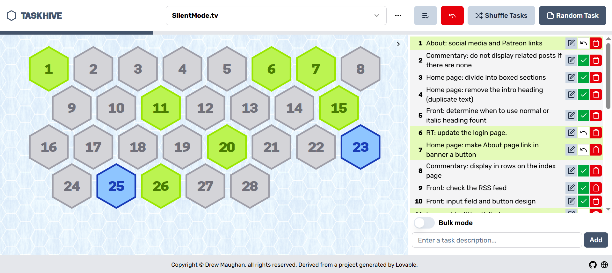

# hex-task-hive

A to-do list with a difference, inspired by my "99 Projects" campaign for 2025.

Instead of the traditional vertical list, tasks are represented by numeric "rune tokens" in the shape of vertical hexagons. Tasks can be picked at random, and manually marked as complete as progress is made. 

The purpose behind this project was to be able to tackle lists of tasks by picking them at random, which would alleviate the "paralysis of analysis". Of course, if there's a specific task I want to complete, I can focus on that one instead.

## Technologies used in this project

This project was originally "vibe-coded" using [Lovable](https://lovable.dev), but *refined by me* - because **AI should be used as a tool, not a weapon**.

Lovable scaffolded this project with:

- Vite
- TypeScript
- React
- shadcn-ui
- Tailwind CSS (although I asked for Bootstrap!).

## Objectives of the project

- Building a useful tool for motivation to complete smaller tasks/projects.
- An adventure in "vibe coding": demonstrating the ability to use Lovable for creating an app.
- Demonstrating the ability to modify an AI-generated app, instead of using it as-is (and pretending I did the work).
- Proof that I can work with a React project.
- Working with Tailwind CSS.
  At the time, and as with other trending technologies, I *really* didn't understand why it became so popular. It was only after starting to use it myself that it demonstrated its usefulness.
- Hopefully useful toward overcoming the age-old, artificially-generated hurdle of not having enough "experience" to gain "experience".

## Features

- Ability to manage multiple lists of tasks (e.g. for different projects).
- Tasks are represented as a hexagonal grid, with each task represented by a hexagonal token.
- Tasks can be easily created, updated and removed.
- The list of tasks can be shuffled, *provided* the tasks have not been completed or picked yet.
- An incomplete task can be picked at random.
- Tasks can be marked as complete, with the date of completion.
- A progress bar displays the ratio of completed tasks.
- If all tasks are complete, confetti is displayed.

## Contributions welcome.

What features would you add to this project? How would you improve upon the existing functionality?

You're more than welcome to open a pull request, whether to pass the time or demonstrate that you yourself can code (and contribute to open-source projects). 